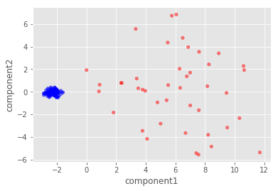

Importing the necessary modules


```python
import math
import pandas as pd
import matplotlib.pyplot as plt
import matplotlib
import numpy as np

from sklearn.decomposition import PCA
from mpl_toolkits.mplot3d import Axes3D
from sklearn import preprocessing

plt.style.use('ggplot')
```

On this occasion I will be applying "Principal Component Analysis" on a highly dimensional dataset, which in this case is the Chronic Kidney Dataset that is available from UCI's machine learning repository. You can download the dataset here: https://archive.ics.uci.edu/ml/datasets/chronic_kidney_disease

Importing the dataset and assign it to the variable "df". For the sake of brevity, rows with NaN values will simply be dropped and I will not be attempting to fill the empty values.


```python
df = pd.read_csv("Dataset/kidney_disease.csv", index_col='id')
df.dropna(inplace=True)
df.head()
```


<div>
<table border="1" class="dataframe">
  <thead>
    <tr style="text-align: right;">
      <th></th>
      <th>age</th>
      <th>bp</th>
      <th>sg</th>
      <th>al</th>
      <th>su</th>
      <th>rbc</th>
      <th>pc</th>
      <th>pcc</th>
      <th>ba</th>
      <th>bgr</th>
      <th>...</th>
      <th>pcv</th>
      <th>wc</th>
      <th>rc</th>
      <th>htn</th>
      <th>dm</th>
      <th>cad</th>
      <th>appet</th>
      <th>pe</th>
      <th>ane</th>
      <th>classification</th>
    </tr>
    <tr>
      <th>id</th>
      <th></th>
      <th></th>
      <th></th>
      <th></th>
      <th></th>
      <th></th>
      <th></th>
      <th></th>
      <th></th>
      <th></th>
      <th></th>
      <th></th>
      <th></th>
      <th></th>
      <th></th>
      <th></th>
      <th></th>
      <th></th>
      <th></th>
      <th></th>
      <th></th>
    </tr>
  </thead>
  <tbody>
    <tr>
      <th>3</th>
      <td>48.0</td>
      <td>70.0</td>
      <td>1.005</td>
      <td>4.0</td>
      <td>0.0</td>
      <td>normal</td>
      <td>abnormal</td>
      <td>present</td>
      <td>notpresent</td>
      <td>117.0</td>
      <td>...</td>
      <td>32</td>
      <td>6700</td>
      <td>3.9</td>
      <td>yes</td>
      <td>no</td>
      <td>no</td>
      <td>poor</td>
      <td>yes</td>
      <td>yes</td>
      <td>ckd</td>
    </tr>
    <tr>
      <th>9</th>
      <td>53.0</td>
      <td>90.0</td>
      <td>1.020</td>
      <td>2.0</td>
      <td>0.0</td>
      <td>abnormal</td>
      <td>abnormal</td>
      <td>present</td>
      <td>notpresent</td>
      <td>70.0</td>
      <td>...</td>
      <td>29</td>
      <td>12100</td>
      <td>3.7</td>
      <td>yes</td>
      <td>yes</td>
      <td>no</td>
      <td>poor</td>
      <td>no</td>
      <td>yes</td>
      <td>ckd</td>
    </tr>
    <tr>
      <th>11</th>
      <td>63.0</td>
      <td>70.0</td>
      <td>1.010</td>
      <td>3.0</td>
      <td>0.0</td>
      <td>abnormal</td>
      <td>abnormal</td>
      <td>present</td>
      <td>notpresent</td>
      <td>380.0</td>
      <td>...</td>
      <td>32</td>
      <td>4500</td>
      <td>3.8</td>
      <td>yes</td>
      <td>yes</td>
      <td>no</td>
      <td>poor</td>
      <td>yes</td>
      <td>no</td>
      <td>ckd</td>
    </tr>
    <tr>
      <th>14</th>
      <td>68.0</td>
      <td>80.0</td>
      <td>1.010</td>
      <td>3.0</td>
      <td>2.0</td>
      <td>normal</td>
      <td>abnormal</td>
      <td>present</td>
      <td>present</td>
      <td>157.0</td>
      <td>...</td>
      <td>16</td>
      <td>11000</td>
      <td>2.6</td>
      <td>yes</td>
      <td>yes</td>
      <td>yes</td>
      <td>poor</td>
      <td>yes</td>
      <td>no</td>
      <td>ckd</td>
    </tr>
    <tr>
      <th>20</th>
      <td>61.0</td>
      <td>80.0</td>
      <td>1.015</td>
      <td>2.0</td>
      <td>0.0</td>
      <td>abnormal</td>
      <td>abnormal</td>
      <td>notpresent</td>
      <td>notpresent</td>
      <td>173.0</td>
      <td>...</td>
      <td>24</td>
      <td>9200</td>
      <td>3.2</td>
      <td>yes</td>
      <td>yes</td>
      <td>yes</td>
      <td>poor</td>
      <td>yes</td>
      <td>yes</td>
      <td>ckd</td>
    </tr>
  </tbody>
</table>
<p>5 rows × 25 columns</p>
</div>


To better visualize the usage of PCA, I will separate the "classification" column and replace chronic kidney disease (ckd) string with the string "red" and the all other values with the string "blue". These values will later be passed on as color arguments on the scatter plot function.


```python
colSep = ['red' if i=='ckd' else 'blue' for i in df.classification]
df.drop(labels=['classification'], axis=1, inplace=True)
```

See the data types of each column


```python
df.dtypes
```


    age      float64
    bp       float64
    sg       float64
    al       float64
    su       float64
    rbc       object
    pc        object
    pcc       object
    ba        object
    bgr      float64
    bu       float64
    sc       float64
    sod      float64
    pot      float64
    hemo     float64
    pcv       object
    wc        object
    rc        object
    htn       object
    dm        object
    cad       object
    appet     object
    pe        object
    ane       object
    dtype: object


```python
df[['rbc', 'pc', 'pcc', 'ba', 'htn', 'dm', 'cad', 'appet', 'pe', 'ane']].head()
```


<div>

<table border="1" class="dataframe">
  <thead>
    <tr style="text-align: right;">
      <th></th>
      <th>rbc</th>
      <th>pc</th>
      <th>pcc</th>
      <th>ba</th>
      <th>htn</th>
      <th>dm</th>
      <th>cad</th>
      <th>appet</th>
      <th>pe</th>
      <th>ane</th>
    </tr>
    <tr>
      <th>id</th>
      <th></th>
      <th></th>
      <th></th>
      <th></th>
      <th></th>
      <th></th>
      <th></th>
      <th></th>
      <th></th>
      <th></th>
    </tr>
  </thead>
  <tbody>
    <tr>
      <th>3</th>
      <td>normal</td>
      <td>abnormal</td>
      <td>present</td>
      <td>notpresent</td>
      <td>yes</td>
      <td>no</td>
      <td>no</td>
      <td>poor</td>
      <td>yes</td>
      <td>yes</td>
    </tr>
    <tr>
      <th>9</th>
      <td>abnormal</td>
      <td>abnormal</td>
      <td>present</td>
      <td>notpresent</td>
      <td>yes</td>
      <td>yes</td>
      <td>no</td>
      <td>poor</td>
      <td>no</td>
      <td>yes</td>
    </tr>
    <tr>
      <th>11</th>
      <td>abnormal</td>
      <td>abnormal</td>
      <td>present</td>
      <td>notpresent</td>
      <td>yes</td>
      <td>yes</td>
      <td>no</td>
      <td>poor</td>
      <td>yes</td>
      <td>no</td>
    </tr>
    <tr>
      <th>14</th>
      <td>normal</td>
      <td>abnormal</td>
      <td>present</td>
      <td>present</td>
      <td>yes</td>
      <td>yes</td>
      <td>yes</td>
      <td>poor</td>
      <td>yes</td>
      <td>no</td>
    </tr>
    <tr>
      <th>20</th>
      <td>abnormal</td>
      <td>abnormal</td>
      <td>notpresent</td>
      <td>notpresent</td>
      <td>yes</td>
      <td>yes</td>
      <td>yes</td>
      <td>poor</td>
      <td>yes</td>
      <td>yes</td>
    </tr>
  </tbody>
</table>
</div>


We can see from the above table that there are several nominal features from the dataset that must be re-encoded in order for them to be properly analysed, one way of using this is to use the get_dummies function as you can see in the code below


```python
df = pd.get_dummies(df,columns=['rbc', 'pc', 'pcc', 'ba', 'htn', 'dm', 'cad', 'appet', 'pe', 'ane'])
df.dtypes
```


    age               float64
    bp                float64
    sg                float64
    al                float64
    su                float64
    bgr               float64
    bu                float64
    sc                float64
    sod               float64
    pot               float64
    hemo              float64
    pcv                object
    wc                 object
    rc                 object
    rbc_abnormal        uint8
    rbc_normal          uint8
    pc_abnormal         uint8
    pc_normal           uint8
    pcc_notpresent      uint8
    pcc_present         uint8
    ba_notpresent       uint8
    ba_present          uint8
    htn_no              uint8
    htn_yes             uint8
    dm_no               uint8
    dm_yes              uint8
    cad_no              uint8
    cad_yes             uint8
    appet_good          uint8
    appet_poor          uint8
    pe_no               uint8
    pe_yes              uint8
    ane_no              uint8
    ane_yes             uint8
    dtype: object


As you can see in the above list of column and their respective data types, get_dummies function will create a new column for each distinct values of the column passed to it, it will then fill the columns with 1s and 0s depending on the inclusion of the row.

I will then convert the rest of the object-typed columns into a numeric data type


```python
df.wc = pd.to_numeric(df.wc, errors='coerce')
df.rc = pd.to_numeric(df.rc, errors='coerce')
df.pcv = pd.to_numeric(df.pcv, errors='coerce')
```

I will now analyze the amount of variability of each features by calculating their's standard deviations.


```python
df.describe()
```


<div>

<table border="1" class="dataframe">
  <thead>
    <tr style="text-align: right;">
      <th></th>
      <th>age</th>
      <th>bp</th>
      <th>sg</th>
      <th>al</th>
      <th>su</th>
      <th>bgr</th>
      <th>bu</th>
      <th>sc</th>
      <th>sod</th>
      <th>pot</th>
      <th>...</th>
      <th>dm_no</th>
      <th>dm_yes</th>
      <th>cad_no</th>
      <th>cad_yes</th>
      <th>appet_good</th>
      <th>appet_poor</th>
      <th>pe_no</th>
      <th>pe_yes</th>
      <th>ane_no</th>
      <th>ane_yes</th>
    </tr>
  </thead>
  <tbody>
    <tr>
      <th>count</th>
      <td>158.000000</td>
      <td>158.000000</td>
      <td>158.000000</td>
      <td>158.000000</td>
      <td>158.000000</td>
      <td>158.000000</td>
      <td>158.000000</td>
      <td>158.000000</td>
      <td>158.000000</td>
      <td>158.000000</td>
      <td>...</td>
      <td>158.000000</td>
      <td>158.000000</td>
      <td>158.000000</td>
      <td>158.000000</td>
      <td>158.000000</td>
      <td>158.000000</td>
      <td>158.000000</td>
      <td>158.000000</td>
      <td>158.000000</td>
      <td>158.000000</td>
    </tr>
    <tr>
      <th>mean</th>
      <td>49.563291</td>
      <td>74.050633</td>
      <td>1.019873</td>
      <td>0.797468</td>
      <td>0.253165</td>
      <td>131.341772</td>
      <td>52.575949</td>
      <td>2.188608</td>
      <td>138.848101</td>
      <td>4.636709</td>
      <td>...</td>
      <td>0.822785</td>
      <td>0.177215</td>
      <td>0.930380</td>
      <td>0.069620</td>
      <td>0.879747</td>
      <td>0.120253</td>
      <td>0.873418</td>
      <td>0.126582</td>
      <td>0.898734</td>
      <td>0.101266</td>
    </tr>
    <tr>
      <th>std</th>
      <td>15.512244</td>
      <td>11.175381</td>
      <td>0.005499</td>
      <td>1.413130</td>
      <td>0.813397</td>
      <td>64.939832</td>
      <td>47.395382</td>
      <td>3.077615</td>
      <td>7.489421</td>
      <td>3.476351</td>
      <td>...</td>
      <td>0.383065</td>
      <td>0.383065</td>
      <td>0.255315</td>
      <td>0.255315</td>
      <td>0.326292</td>
      <td>0.326292</td>
      <td>0.333562</td>
      <td>0.333562</td>
      <td>0.302640</td>
      <td>0.302640</td>
    </tr>
    <tr>
      <th>min</th>
      <td>6.000000</td>
      <td>50.000000</td>
      <td>1.005000</td>
      <td>0.000000</td>
      <td>0.000000</td>
      <td>70.000000</td>
      <td>10.000000</td>
      <td>0.400000</td>
      <td>111.000000</td>
      <td>2.500000</td>
      <td>...</td>
      <td>0.000000</td>
      <td>0.000000</td>
      <td>0.000000</td>
      <td>0.000000</td>
      <td>0.000000</td>
      <td>0.000000</td>
      <td>0.000000</td>
      <td>0.000000</td>
      <td>0.000000</td>
      <td>0.000000</td>
    </tr>
    <tr>
      <th>25%</th>
      <td>39.250000</td>
      <td>60.000000</td>
      <td>1.020000</td>
      <td>0.000000</td>
      <td>0.000000</td>
      <td>97.000000</td>
      <td>26.000000</td>
      <td>0.700000</td>
      <td>135.000000</td>
      <td>3.700000</td>
      <td>...</td>
      <td>1.000000</td>
      <td>0.000000</td>
      <td>1.000000</td>
      <td>0.000000</td>
      <td>1.000000</td>
      <td>0.000000</td>
      <td>1.000000</td>
      <td>0.000000</td>
      <td>1.000000</td>
      <td>0.000000</td>
    </tr>
    <tr>
      <th>50%</th>
      <td>50.500000</td>
      <td>80.000000</td>
      <td>1.020000</td>
      <td>0.000000</td>
      <td>0.000000</td>
      <td>115.500000</td>
      <td>39.500000</td>
      <td>1.100000</td>
      <td>139.000000</td>
      <td>4.500000</td>
      <td>...</td>
      <td>1.000000</td>
      <td>0.000000</td>
      <td>1.000000</td>
      <td>0.000000</td>
      <td>1.000000</td>
      <td>0.000000</td>
      <td>1.000000</td>
      <td>0.000000</td>
      <td>1.000000</td>
      <td>0.000000</td>
    </tr>
    <tr>
      <th>75%</th>
      <td>60.000000</td>
      <td>80.000000</td>
      <td>1.025000</td>
      <td>1.000000</td>
      <td>0.000000</td>
      <td>131.750000</td>
      <td>49.750000</td>
      <td>1.600000</td>
      <td>144.000000</td>
      <td>4.900000</td>
      <td>...</td>
      <td>1.000000</td>
      <td>0.000000</td>
      <td>1.000000</td>
      <td>0.000000</td>
      <td>1.000000</td>
      <td>0.000000</td>
      <td>1.000000</td>
      <td>0.000000</td>
      <td>1.000000</td>
      <td>0.000000</td>
    </tr>
    <tr>
      <th>max</th>
      <td>83.000000</td>
      <td>110.000000</td>
      <td>1.025000</td>
      <td>4.000000</td>
      <td>5.000000</td>
      <td>490.000000</td>
      <td>309.000000</td>
      <td>15.200000</td>
      <td>150.000000</td>
      <td>47.000000</td>
      <td>...</td>
      <td>1.000000</td>
      <td>1.000000</td>
      <td>1.000000</td>
      <td>1.000000</td>
      <td>1.000000</td>
      <td>1.000000</td>
      <td>1.000000</td>
      <td>1.000000</td>
      <td>1.000000</td>
      <td>1.000000</td>
    </tr>
  </tbody>
</table>
<p>8 rows × 34 columns</p>
</div>


It appears that the features in this dataset have a significant difference in variability, this is not good as PCA relies on calulating the variance of each row in the dataset to find the principal component, having a column with a larger standard deviation value will mess with this calculation.

To mitigate this problem, I will standardize the dataset prior to applying the PCA


```python
temp = preprocessing.StandardScaler().fit_transform(df)
df = pd.DataFrame(temp, columns=df.columns)
df.describe()
```


<div>

<table border="1" class="dataframe">
  <thead>
    <tr style="text-align: right;">
      <th></th>
      <th>age</th>
      <th>bp</th>
      <th>sg</th>
      <th>al</th>
      <th>su</th>
      <th>bgr</th>
      <th>bu</th>
      <th>sc</th>
      <th>sod</th>
      <th>pot</th>
      <th>...</th>
      <th>dm_no</th>
      <th>dm_yes</th>
      <th>cad_no</th>
      <th>cad_yes</th>
      <th>appet_good</th>
      <th>appet_poor</th>
      <th>pe_no</th>
      <th>pe_yes</th>
      <th>ane_no</th>
      <th>ane_yes</th>
    </tr>
  </thead>
  <tbody>
    <tr>
      <th>count</th>
      <td>1.580000e+02</td>
      <td>1.580000e+02</td>
      <td>1.580000e+02</td>
      <td>1.580000e+02</td>
      <td>1.580000e+02</td>
      <td>1.580000e+02</td>
      <td>1.580000e+02</td>
      <td>158.000000</td>
      <td>1.580000e+02</td>
      <td>1.580000e+02</td>
      <td>...</td>
      <td>1.580000e+02</td>
      <td>158.000000</td>
      <td>1.580000e+02</td>
      <td>1.580000e+02</td>
      <td>1.580000e+02</td>
      <td>1.580000e+02</td>
      <td>158.000000</td>
      <td>158.000000</td>
      <td>1.580000e+02</td>
      <td>1.580000e+02</td>
    </tr>
    <tr>
      <th>mean</th>
      <td>8.432074e-17</td>
      <td>5.846238e-16</td>
      <td>-1.304161e-15</td>
      <td>-1.349132e-16</td>
      <td>-2.248553e-17</td>
      <td>-4.497106e-17</td>
      <td>8.994212e-17</td>
      <td>0.000000</td>
      <td>9.893633e-16</td>
      <td>5.621382e-17</td>
      <td>...</td>
      <td>-1.349132e-16</td>
      <td>0.000000</td>
      <td>1.798842e-16</td>
      <td>-6.745659e-17</td>
      <td>4.497106e-17</td>
      <td>-4.497106e-17</td>
      <td>0.000000</td>
      <td>0.000000</td>
      <td>4.497106e-17</td>
      <td>-8.994212e-17</td>
    </tr>
    <tr>
      <th>std</th>
      <td>1.003180e+00</td>
      <td>1.003180e+00</td>
      <td>1.003180e+00</td>
      <td>1.003180e+00</td>
      <td>1.003180e+00</td>
      <td>1.003180e+00</td>
      <td>1.003180e+00</td>
      <td>1.003180</td>
      <td>1.003180e+00</td>
      <td>1.003180e+00</td>
      <td>...</td>
      <td>1.003180e+00</td>
      <td>1.003180</td>
      <td>1.003180e+00</td>
      <td>1.003180e+00</td>
      <td>1.003180e+00</td>
      <td>1.003180e+00</td>
      <td>1.003180</td>
      <td>1.003180</td>
      <td>1.003180e+00</td>
      <td>1.003180e+00</td>
    </tr>
    <tr>
      <th>min</th>
      <td>-2.817246e+00</td>
      <td>-2.158952e+00</td>
      <td>-2.713365e+00</td>
      <td>-5.661221e-01</td>
      <td>-3.122333e-01</td>
      <td>-9.475974e-01</td>
      <td>-9.011706e-01</td>
      <td>-0.583015</td>
      <td>-3.730148e+00</td>
      <td>-6.165957e-01</td>
      <td>...</td>
      <td>-2.154729e+00</td>
      <td>-0.464095</td>
      <td>-3.655631e+00</td>
      <td>-2.735506e-01</td>
      <td>-2.704772e+00</td>
      <td>-3.697170e-01</td>
      <td>-2.626785</td>
      <td>-0.380693</td>
      <td>-2.979094e+00</td>
      <td>-3.356725e-01</td>
    </tr>
    <tr>
      <th>25%</th>
      <td>-6.669624e-01</td>
      <td>-1.261282e+00</td>
      <td>2.309247e-02</td>
      <td>-5.661221e-01</td>
      <td>-3.122333e-01</td>
      <td>-5.305059e-01</td>
      <td>-5.625116e-01</td>
      <td>-0.485227</td>
      <td>-5.154386e-01</td>
      <td>-2.703085e-01</td>
      <td>...</td>
      <td>4.640955e-01</td>
      <td>-0.464095</td>
      <td>2.735506e-01</td>
      <td>-2.735506e-01</td>
      <td>3.697170e-01</td>
      <td>-3.697170e-01</td>
      <td>0.380693</td>
      <td>-0.380693</td>
      <td>3.356725e-01</td>
      <td>-3.356725e-01</td>
    </tr>
    <tr>
      <th>50%</th>
      <td>6.057713e-02</td>
      <td>5.340564e-01</td>
      <td>2.309247e-02</td>
      <td>-5.661221e-01</td>
      <td>-3.122333e-01</td>
      <td>-2.447210e-01</td>
      <td>-2.767680e-01</td>
      <td>-0.354843</td>
      <td>2.034626e-02</td>
      <td>-3.945044e-02</td>
      <td>...</td>
      <td>4.640955e-01</td>
      <td>-0.464095</td>
      <td>2.735506e-01</td>
      <td>-2.735506e-01</td>
      <td>3.697170e-01</td>
      <td>-3.697170e-01</td>
      <td>0.380693</td>
      <td>-0.380693</td>
      <td>3.356725e-01</td>
      <td>-3.356725e-01</td>
    </tr>
    <tr>
      <th>75%</th>
      <td>6.749439e-01</td>
      <td>5.340564e-01</td>
      <td>9.352451e-01</td>
      <td>1.437770e-01</td>
      <td>-3.122333e-01</td>
      <td>6.306235e-03</td>
      <td>-5.981458e-02</td>
      <td>-0.191863</td>
      <td>6.900774e-01</td>
      <td>7.597862e-02</td>
      <td>...</td>
      <td>4.640955e-01</td>
      <td>-0.464095</td>
      <td>2.735506e-01</td>
      <td>-2.735506e-01</td>
      <td>3.697170e-01</td>
      <td>-3.697170e-01</td>
      <td>0.380693</td>
      <td>-0.380693</td>
      <td>3.356725e-01</td>
      <td>-3.356725e-01</td>
    </tr>
    <tr>
      <th>max</th>
      <td>2.162358e+00</td>
      <td>3.227064e+00</td>
      <td>9.352451e-01</td>
      <td>2.273474e+00</td>
      <td>5.854375e+00</td>
      <td>5.540492e+00</td>
      <td>5.427520e+00</td>
      <td>4.241194</td>
      <td>1.493755e+00</td>
      <td>1.222489e+01</td>
      <td>...</td>
      <td>4.640955e-01</td>
      <td>2.154729</td>
      <td>2.735506e-01</td>
      <td>3.655631e+00</td>
      <td>3.697170e-01</td>
      <td>2.704772e+00</td>
      <td>0.380693</td>
      <td>2.626785</td>
      <td>3.356725e-01</td>
      <td>2.979094e+00</td>
    </tr>
  </tbody>
</table>
<p>8 rows × 34 columns</p>
</div>


There we go, now the standard deviation of each column is about 1, I can now finally apply PCA to the dataset.

In the code below you can see that I will reduce the dimensionality of the dataset down to just 2 components


```python
pca = PCA(n_components=2)
pca.fit(df)
PCA(copy=True, n_components=2, whiten=False)
T = pca.transform(df)
T.shape
```


    (158, 2)


I will now visualize the transformed dataset to a scatter plot and color each individual data according to it's diagnosis: red for chronic kidney disease and blue for the rest


```python
T = pd.DataFrame(T)
T.columns = ['component1', 'component2']
T.plot.scatter(x='component1', y='component2', marker='o', alpha=0.5, c=colSep)
plt.show()
```





As we can see in the above scatter plot the PCA transformation has find a plane in which the chronic kidney disease data can be easily distinguished. PCA has reduced the highly dimensional dataset down to just 2 dimensions, and in doing so, PCA has provided us with a better visualization of the dataset.


```python

```
