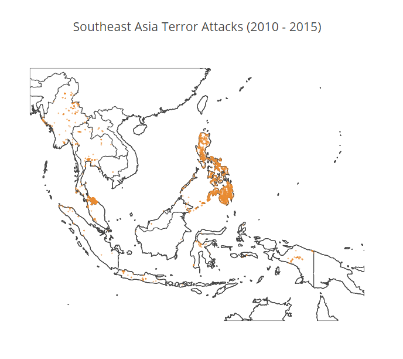
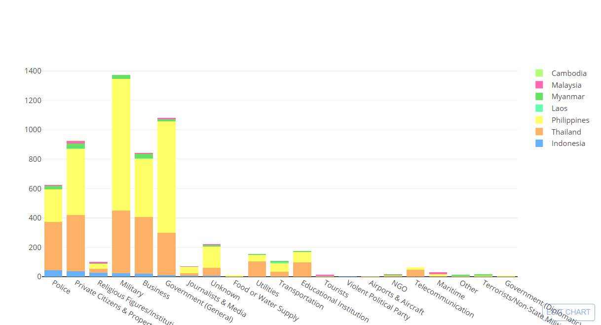
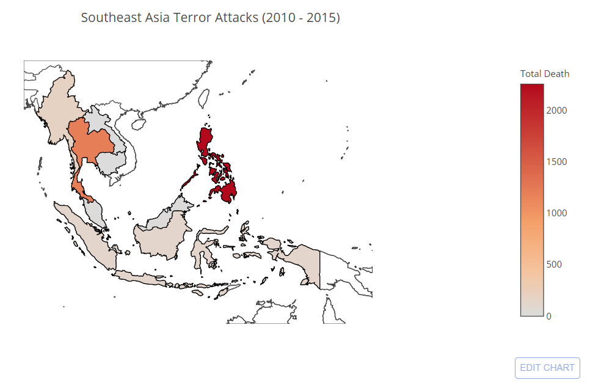

Importing modules needed for this for this data analysis


```python
import pandas as pd
import numpy as np
import matplotlib.pyplot as plt
import plotly.plotly as py
import pycountry
import warnings
import plotly.graph_objs as go

warnings.filterwarnings('ignore')
```

We will be analyzing the global terrorism database collected by the START Consortium, I obtained the dataset from the following link https://www.kaggle.com/START-UMD/gtd, feel free to download and analyze it yourself


```python
df = pd.read_csv('Dataset/globalterrorismdb_0617dist.csv', encoding='ISO-8859-1')
```

The dataset is very comprehensive, containing more than 170,000 occurrence of terrorist attacks worldwide during a time period of 1970 to 2015. In this occasion, I will concentrate on analyzing terrorism in Southeast Asia that occured since 2010.


```python
terror_data = df.loc[(df['region_txt'] == 'Southeast Asia') & (df['iyear'] >= 2010)]
```

Next, I will visualize the location of each terrorist attacks on Southeast Asia


```python
data = [ dict(
        type = 'scattergeo',
        lon = terror_data['longitude'],
        lat = terror_data['latitude'],
        mode = 'markers',
        marker = dict(
            size = 1,
            opacity = 0.6,
            line = dict(
                width=1,
                color = 'rgb(240, 140, 45)'
            )
        ))]

layout = dict(
    title = 'Southeast Asia Terror Attacks (2010 - 2015)',
    geo = dict(
        resolution = 50,
        scope = 'Southeast Asia',
        showframe = False,
        showcoastlines = True,
        showcountries = True,

        lonaxis = dict(range = [90, 150]),
        lataxis = dict(range = [-15, 30])
    )
)

fig = dict( data=data, layout=layout )
py.iplot( fig, validate=False, filename='sea_map_terror' )
```





It seems that a majority of terror attacks are concentrated on the Philippines, with terror attacks having occurred in all parts of the country. However, it seems that there more terror attacks on the southern part of the Philippines. I suspect the majority of these attacks are perpetrated by Moro insurgents.

I will analyze the targets of these terrorist attacks so first I will list each of the targets recorded on the dataset


```python
terror_data['targtype1_txt'].unique()
```


    array(['Government (General)', 'Private Citizens & Property',
           'Educational Institution', 'Religious Figures/Institutions',
           'Business', 'Police', 'Terrorists/Non-State Militia',
           'Telecommunication', 'NGO', 'Utilities', 'Military',
           'Food or Water Supply', 'Journalists & Media', 'Transportation',
           'Unknown', 'Government (Diplomatic)', 'Maritime', 'Tourists',
           'Airports & Aircraft', 'Other', 'Violent Political Party'], dtype=object)


I will now list all the available Southeast Asian countries on the terror_data subset


```python
terror_data['country_txt'].unique()
```


    array(['Philippines', 'Thailand', 'Indonesia', 'Myanmar', 'Laos',
           'Malaysia', 'Cambodia'], dtype=object)


It seems that some countries on Southeast Asia such as Brunei, Singapore, and Vietnam is not available on the dataset, so we are limited to only the 7 countries listed above.

I will now count the total attacks of each target type


```python
terror_data['targtype1_txt'].value_counts()
```


    Military                          1375
    Government (General)              1080
    Private Citizens & Property        925
    Business                           843
    Police                             623
    Unknown                            219
    Educational Institution            173
    Utilities                          154
    Transportation                     109
    Religious Figures/Institutions      97
    Journalists & Media                 71
    Telecommunication                   64
    Maritime                            29
    NGO                                 14
    Terrorists/Non-State Militia        13
    Food or Water Supply                11
    Tourists                             9
    Other                                9
    Government (Diplomatic)              6
    Airports & Aircraft                  4
    Violent Political Party              1
    Name: targtype1_txt, dtype: int64


Most of the terror attacks on Southeast Asia are targeted towards the military with 1375 number of attacks occurring since 2010, Government are the next in the list with 1080 attack count.

I will split the above count and assign the total to each Southeast Asian countries using the below function


```python
def fetch_data(country):
    data = terror_data.loc[df['country_txt'] == country]
    result = data['targtype1_txt'].value_counts()
    return result
```

Let's test the function using Malaysia as the argument


```python
fetch_data('Malaysia')
```


    Private Citizens & Property       15
    Maritime                          11
    Government (General)               7
    Business                           7
    Police                             4
    Religious Figures/Institutions     2
    Unknown                            2
    Journalists & Media                1
    Tourists                           1
    NGO                                1
    Name: targtype1_txt, dtype: int64


Now that the function works as it is intended, I will chart the total count of attacks to each types of target according to the country in which the attack took place


```python
trace1 = go.Bar(
    x=fetch_data('Indonesia').index,
    y=fetch_data('Indonesia').values,
    name='Indonesia',
    orientation='v',
    marker = dict(
        color = "rgb(102, 178, 255)"
    )
)

trace2 = go.Bar(
    x=fetch_data('Thailand').index,
    y=fetch_data('Thailand').values,
    name='Thailand',
    orientation='v',
    marker = dict(
        color = "rgb(255, 178, 102)"
    )
)

trace3 = go.Bar(
    x=fetch_data('Philippines').index,
    y=fetch_data('Philippines').values,
    name='Philippines',
    orientation='v',
    marker = dict(
        color = "rgb(255, 255, 102)"
    )
)

trace4 = go.Bar(
    x=fetch_data('Laos').index,
    y=fetch_data('Laos').values,
    name='Laos',
    orientation='v',
    marker = dict(
        color = "rgb(102, 255, 178)"
    )
)

trace5 = go.Bar(
    x=fetch_data('Myanmar').index,
    y=fetch_data('Myanmar').values,
    name='Myanmar',
    orientation='v',
    marker = dict(
        color = "rgb(102, 225, 102)"
    )
)

trace6 = go.Bar(
    x=fetch_data('Malaysia').index,
    y=fetch_data('Malaysia').values,
    name='Malaysia',
    orientation='v',
    marker = dict(
        color = "rgb(255, 102, 178)"
    )
)

trace7 = go.Bar(
    x=fetch_data('Cambodia').index,
    y=fetch_data('Cambodia').values,
    name='Cambodia',
    orientation='v',
    marker = dict(
        color = "rgb(178, 255, 120)"
    )
)

data = [trace1, trace2, trace3, trace4, trace5, trace6, trace7]
layout = go.Layout(
    barmode='stack'
)

fig = go.Figure(data=data, layout=layout)
py.iplot(fig, filename='marker-bar')
```





Below I will attempt to create a choropleth map of total number of deaths from terrorist attacks from 2010 to 2015


```python
total_death_country = terror_data.groupby(terror_data['country_txt']).nkill.sum()

data = [ dict(
        type='choropleth',
        locationmode = 'country names',
        locations = total_death_country.index,
        z = total_death_country.values.astype(int),
        colorbar = dict(
            title = "Total Death"
        )
    ) ]

layout = dict(
    title = 'Southeast Asia Terror Attacks (2010 - 2015)',
    geo = dict(
        resolution = 50,
        scope = 'Southeast Asia',
        showframe = False,
        showcoastlines = True,
        showcountries = True,

        lonaxis = dict(range = [90, 150]),
        lataxis = dict(range = [-15, 30])
    )
)

fig = dict(data=data, layout=layout)
py.iplot(fig, filename='d3-cloropleth-map')
```




Unsurprisingly, Philippines has the highest number of casualties in Southeast Asia with the number of deaths going as high as 2253 people, followed by Thailand at 1198 deaths and Myanmar at 188 deaths


```python

```
